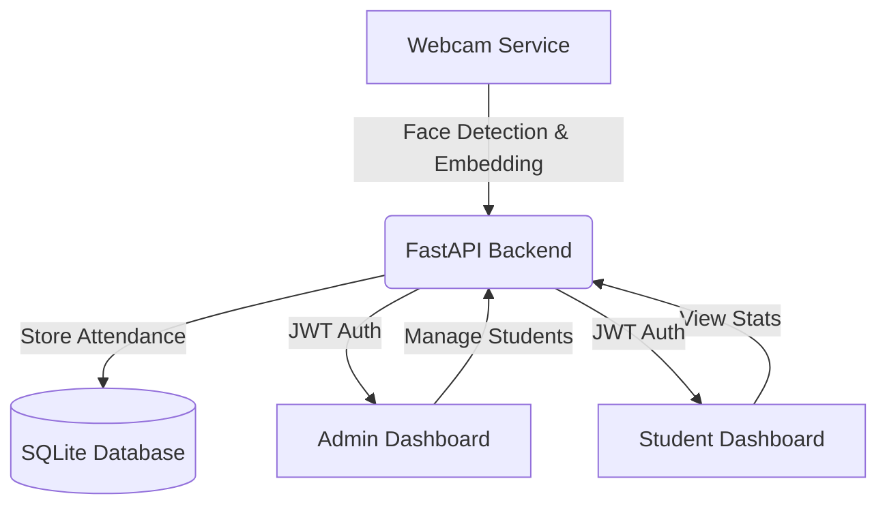

# 🧑‍🎓 Face Recognition Attendance Management System

[](https://fastapi.tiangolo.com/)
[](https://reactjs.org/)
[](https://www.typescriptlang.org/)
[](https://pytorch.org/)
[](https://tailwindcss.com/)

A state-of-the-art **Full-Stack Attendance Management System** leveraging **Facial Recognition** and **Liveness Detection** to automate student check-ins. Built with a high-performance FastAPI backend and a sleek, responsive React dashboard.

---

## 🌟 Key Features

### 👨‍🏫 Admin Portal
*   **Real-time Dashboard**: Monitor student attendance with dynamic charts and live statistics.
*   **Student Management**: Add, update, and manage student profiles with face registration.
*   **History & Reports**: View detailed historical attendance logs and export data to **CSV**.
*   **Today's View**: Instantly see who is present or absent for the current day.

### 👨‍🎓 Student Portal
*   **Attendance Statistics**: Students can track their overall attendance percentage and history.
*   **Personal Dashboard**: A simplified view for students to monitor their consistency.

### 📷 Smart Attendance Service
*   **MTCNN & FaceNet**: High-accuracy face detection and embedding extraction using PyTorch.
*   **Liveness Detection**: Integrated **blink detection** to prevent spoofing attacks (photos/videos).
*   **Automatic Sync**: Seamlessly marks attendance via API calls once a match is confirmed.

---

## 🏗️ Architecture



---

## 🛠️ Tech Stack

### 💻 Frontend
*   **Framework**: React 19 (TypeScript)
*   **Build Tool**: Vite
*   **Styling**: Tailwind CSS 4
*   **Visualization**: Recharts
*   **Networking**: Axios & React Router 7

### ⚙️ Backend API
*   **Framework**: FastAPI (Python 3.10+)
*   **Auth**: JWT (OAuth2) with Password Hashing (passlib/bcrypt)
*   **Database**: SQLite with parameterized queries for security.

### 🧠 AI / Service Layer
*   **Detection**: MTCNN (Multi-task Cascaded Convolutional Networks)
*   **Embeddings**: InceptionResnetV1 (Pre-trained on VGGFace2)
*   **Distance**: Cosine Similarity matching.

---

## 📂 Project Structure

```text
face-recognition-attendance-system/
├── backend_api/          # FastAPI main application & routers
├── frontend/             # React dashboard source code
├── attendance_service/   # Real-time camera recognition & liveness logic
├── backend/              # Database scripts and management helpers
├── database/             # SQLite storage & database connection helpers
├── models/               # Pre-trained models and face embeddings
└── README.md             # Project documentation
```

---

## 🚀 Setup & Installation

### 1️⃣ Backend API Setup
Navigate to the root directory and set up the Python environment:
```bash
# Create and activate virtual environment
python -m venv venv
source venv/bin/activate  # Linux/macOS
# OR: venv\Scripts\activate  # Windows

# Install dependencies
pip install fastapi uvicorn passlib[bcrypt] python-jose[cryptography] python-multipart requests torch torchvision facenet-pytorch opencv-python scikit-learn pillow

# Initialize the database
python backend/init_db.py

# Start the API server
uvicorn backend_api.main:app --reload
```
*API runs at: `http://localhost:8000`*

### 2️⃣ Frontend Dashboard Setup
```bash
cd frontend
npm install
npm run dev
```
*Frontend runs at: `http://localhost:5173`*

### 3️⃣ Attendance Camera Service
The camera service runs independently and communicates with the API.
```bash
cd attendance_service
# Run the camera service
python main.py
```

---

## ⚙️ Configuration
You can adjust recognition parameters in `attendance_service/config.py`:
*   `FACE_THRESHOLD`: Minimum confidence score for a match (Default: 0.70).
*   `FRAME_SKIP`: Number of frames to skip for performance optimization.
*   `CAMERA_INDEX`: ID of the camera source (0 for default).

---

## 📌 Roadmap
- [ ] WebSocket integration for real-time dashboard push notifications.
- [ ] Multi-class/Section support for university scaling.
- [ ] Dockerization for simplified deployment.
- [ ] Email notifications for parents/guardians on absence.

---

## 👨‍💻 Author
**Akif Naveed**
*Software Engineering Student | AI & Full Stack Developer*
- [LinkedIn](https://www.linkedin.com/in/akif-naveed/)
- [GitHub](https://github.com/AkifNaveed12)

---
*Maintained collaboratively for academic and enhancement purposes.*